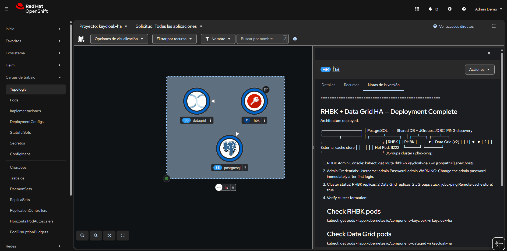

# RHBK + Data Grid — High Availability Sample

Helm chart for **Red Hat Build of Keycloak (RHBK)** in High Availability mode with **Red Hat Data Grid** as external distributed cache and **PostgreSQL** as the shared database.

---

## OpenShift Topology



---

## Architecture

```
┌──────────────────────────────────┐
│         PostgreSQL               │
│  Shared DB + JDBC_PING discovery │
└───────────────┬──────────────────┘
                │
        ┌───────┴───────┐
        │               │
   ┌────┴────┐   ┌──────┴──┐       ┌────────────────────────────┐
   │ RHBK-1  │   │ RHBK-2  │──────►│  Red Hat Data Grid (x2)    │
   │         │◄─►│         │       │  External distributed      │
   │ JGroups │   │ JGroups │       │  cache (Hot Rod: 11222)     │
   └─────────┘   └─────────┘       └────────────────────────────┘
        JGroups cluster
        (jdbc-ping via PostgreSQL)
```

### How it works

| Component | Role |
|-----------|------|
| **RHBK (x2)** | Two Keycloak instances clustered via **JGroups** using the `jdbc-ping` stack. Both nodes share the same PostgreSQL database for user data and cluster discovery. The `multi-site` feature enables connection to an external Data Grid for distributed session caching. |
| **Data Grid (x2)** | Two Infinispan server instances forming their own cluster via **JGroups DNS_PING** (headless Kubernetes service). They provide a remote distributed cache for Keycloak sessions (`sessions`, `clientSessions`, `offlineSessions`, `authenticationSessions`, etc.). |
| **PostgreSQL (x1)** | Single-instance relational database storing Keycloak realms, users, clients, roles, and authentication data. Also serves as the registry for JGroups `JDBC_PING2` node discovery. |

### JGroups Cluster Communication

- **RHBK cluster**: Uses `jdbc-ping` (default in RHBK 26.x). Nodes register in PostgreSQL and discover each other via database queries. Data transmission on TCP port **7800** with auto-generated mTLS certificates stored in the database.
- **Data Grid cluster**: Uses `kubernetes` stack with `DNS_PING`. A headless Service resolves all Data Grid pod IPs for node discovery.

### Cache Architecture

| Cache | Type | Storage |
|-------|------|---------|
| `realms`, `users`, `authorization`, `keys` | Local | In-memory per RHBK node |
| `work` | Replicated | All RHBK nodes (invalidation messages) |
| `sessions`, `clientSessions` | Distributed | Embedded + remote Data Grid |
| `offlineSessions`, `offlineClientSessions` | Distributed | Embedded + remote Data Grid |
| `authenticationSessions`, `loginFailures`, `actionTokens` | Distributed | Embedded + remote Data Grid |

---

## Prerequisites

- **OpenShift** 4.x / Kubernetes 1.25+
- **Helm** 3.x
- **Red Hat registry access** (`podman login registry.redhat.io`) — or use community images (see below)

---

## Quick Start

### Deploy

```bash
helm install ha ./helm/rhbk-datagrid \
  -n keycloak --create-namespace \
  --set admin.username=admin \
  --set admin.password=changeme \
  --set datagrid.credentials.password=s3cret \
  --set postgresql.credentials.password=dbpass
```

### Verify

```bash
# Check all pods are running
kubectl get pods -n keycloak

# Verify RHBK cluster formation (look for 2 nodes)
kubectl logs -l app.kubernetes.io/component=keycloak -n keycloak | grep ISPN000094

# Verify Data Grid cluster
kubectl exec -it ha-rhbk-datagrid-datagrid-0 -n keycloak -- \
  curl -u developer:s3cret http://localhost:11222/rest/v2/cluster?action=distribution
```

### Access

```bash
# OpenShift Route
kubectl get route -n keycloak

# Or port-forward
kubectl port-forward svc/ha-rhbk-datagrid-rhbk 8080:8080 -n keycloak
# Open http://localhost:8080
```

---

## Using Community Images

If you don't have access to `registry.redhat.io`, use community equivalents:

```bash
helm install ha ./helm/rhbk-datagrid \
  -n keycloak --create-namespace \
  --set rhbk.image.repository=quay.io/keycloak/keycloak \
  --set rhbk.image.tag=26.0 \
  --set datagrid.image.repository=quay.io/infinispan/server \
  --set datagrid.image.tag=15.0 \
  --set postgresql.image.repository=docker.io/library/postgres \
  --set postgresql.image.tag=16-alpine
```

> **Note**: When using the community PostgreSQL image, update the Secret env vars from `POSTGRESQL_*` to `POSTGRES_*` format.

---

## Helm Chart Values

### RHBK

| Parameter | Description | Default |
|-----------|-------------|---------|
| `rhbk.image.repository` | RHBK container image | `registry.redhat.io/rhbk/keycloak-rhel9` |
| `rhbk.image.tag` | Image tag | `26.0` |
| `rhbk.replicas` | Number of RHBK instances | `2` |
| `rhbk.resources.requests.cpu` | CPU request per instance | `500m` |
| `rhbk.resources.requests.memory` | Memory request per instance | `512Mi` |
| `rhbk.resources.limits.cpu` | CPU limit per instance | `1` |
| `rhbk.resources.limits.memory` | Memory limit per instance | `1Gi` |
| `rhbk.cache.stack` | JGroups transport stack | `jdbc-ping` |
| `rhbk.cache.remoteStore.enabled` | Connect to external Data Grid | `true` |
| `rhbk.cache.remoteStore.tlsEnabled` | TLS for Data Grid connection | `false` |
| `rhbk.cache.remoteStore.siteName` | Infinispan site name | `site1` |
| `admin.username` | Admin username | `admin` |
| `admin.password` | Admin password | `admin` |

### Data Grid

| Parameter | Description | Default |
|-----------|-------------|---------|
| `datagrid.enabled` | Deploy Data Grid | `true` |
| `datagrid.image.repository` | Data Grid container image | `registry.redhat.io/datagrid/datagrid-8-rhel9` |
| `datagrid.image.tag` | Image tag | `8.5` |
| `datagrid.replicas` | Number of Data Grid instances | `2` |
| `datagrid.clusterName` | JGroups cluster name | `datagrid-cluster` |
| `datagrid.credentials.username` | Hot Rod username | `developer` |
| `datagrid.credentials.password` | Hot Rod password | `changeme` |
| `datagrid.resources.requests.cpu` | CPU request per instance | `250m` |
| `datagrid.resources.requests.memory` | Memory request per instance | `512Mi` |
| `datagrid.resources.limits.cpu` | CPU limit per instance | `500m` |
| `datagrid.resources.limits.memory` | Memory limit per instance | `1Gi` |
| `datagrid.persistence.enabled` | Enable persistent storage | `false` |
| `datagrid.persistence.size` | PVC size | `1Gi` |

### PostgreSQL

| Parameter | Description | Default |
|-----------|-------------|---------|
| `postgresql.enabled` | Deploy PostgreSQL | `true` |
| `postgresql.image.repository` | PostgreSQL container image | `registry.redhat.io/rhel9/postgresql-16` |
| `postgresql.credentials.database` | Database name | `keycloak` |
| `postgresql.credentials.username` | Database username | `keycloak` |
| `postgresql.credentials.password` | Database password | `changeme` |
| `postgresql.resources.requests.cpu` | CPU request | `250m` |
| `postgresql.resources.requests.memory` | Memory request | `256Mi` |
| `postgresql.persistence.enabled` | Enable persistent storage | `false` |

### Route / Service

| Parameter | Description | Default |
|-----------|-------------|---------|
| `route.enabled` | Create OpenShift Route | `true` |
| `route.host` | Route hostname (auto if empty) | `""` |
| `route.tls.termination` | TLS termination type | `edge` |
| `service.type` | Kubernetes Service type | `ClusterIP` |

---

## Minimum Resources per Instance

| Component | CPU Request | Memory Request | CPU Limit | Memory Limit |
|-----------|------------|----------------|-----------|--------------|
| RHBK | 500m | 512Mi | 1 | 1Gi |
| Data Grid | 250m | 512Mi | 500m | 1Gi |
| PostgreSQL | 250m | 256Mi | 500m | 512Mi |
| **Total (cluster)** | **1.75** | **2.25Gi** | **3** | **4.5Gi** |

---

## References

- [RHBK High Availability Guide](https://docs.redhat.com/en/documentation/red_hat_build_of_keycloak/26.4/html/high_availability_guide/)
- [RHBK Configuring Distributed Caches](https://docs.redhat.com/en/documentation/red_hat_build_of_keycloak/26.4/html/server_configuration_guide/caching-)
- [Connect RHBK with External Data Grid](https://docs.redhat.com/en/documentation/red_hat_build_of_keycloak/24.0/html/high_availability_guide/connect-keycloak-to-external-infinispan-)
- [Data Grid Helm Chart Configuration](https://docs.redhat.com/en/documentation/red_hat_data_grid/8.4/html/building_and_deploying_data_grid_clusters_with_helm/configuring-servers)
- [RHBK Data Grid Sample](https://github.com/maximilianoPizarro/rhbk-datagrid-sample)

---

## License

See repository license file.
